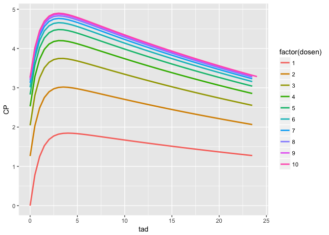

``` r
library(dplyr)
library(mrgsolve)
library(magrittr)
library(ggplot2)
```

Get time-after-dose in simulated output
=======================================

-   Argument to `mrgsim`: `tad = TRUE`

Load a model
------------

-   And we'll increase the volume to get some accumulation

``` r
mod <- mread("pk1cmt", modlib(),quiet=TRUE) %>% param(VC = 50)
```

Simulate with `tad=TRUE`

``` r
out <- 
  mod %>% 
  ev(amt=100,ii=24,addl=9) %>% 
  mrgsim(tad=TRUE,end=240, delta=0.5) 
```

``` r
head(out)
```

    . Model:  pk1cmt

    .   ID time tad       EV1     CENT EV2        CP
    . 1  1  0.0 0.0   0.00000  0.00000   0 0.0000000
    . 2  1  0.0 0.0 100.00000  0.00000   0 0.0000000
    . 3  1  0.5 0.5  60.65307 39.13461   0 0.7826922
    . 4  1  1.0 1.0  36.78794 62.48155   0 1.2496311
    . 5  1  1.5 1.5  22.31302 76.25667   0 1.5251334
    . 6  1  2.0 2.0  13.53353 84.23002   0 1.6846003

``` r
tail(out)
```

    . Model:  pk1cmt

    .     ID  time  tad          EV1     CENT EV2       CP
    . 477  1 237.5 21.5 4.628832e-08 172.6898   0 3.453795
    . 478  1 238.0 22.0 2.773697e-08 170.9715   0 3.419429
    . 479  1 238.5 22.5 1.667283e-08 169.2703   0 3.385405
    . 480  1 239.0 23.0 1.006485e-08 167.5860   0 3.351720
    . 481  1 239.5 23.5 6.050132e-09 165.9185   0 3.318370
    . 482  1 240.0 24.0 3.631493e-09 164.2676   0 3.285351

``` r
unique(out$tad)
```

    .  [1]  0.0  0.5  1.0  1.5  2.0  2.5  3.0  3.5  4.0  4.5  5.0  5.5  6.0  6.5
    . [15]  7.0  7.5  8.0  8.5  9.0  9.5 10.0 10.5 11.0 11.5 12.0 12.5 13.0 13.5
    . [29] 14.0 14.5 15.0 15.5 16.0 16.5 17.0 17.5 18.0 18.5 19.0 19.5 20.0 20.5
    . [43] 21.0 21.5 22.0 22.5 23.0 23.5 24.0

Mark the dose number

``` r
out %<>% mutate(dosen = 1+(time-tad)/24)
```

Plot

``` r
ggplot(out, aes(tad,CP,col=factor(dosen))) + 
  geom_line(lwd=1)
```


