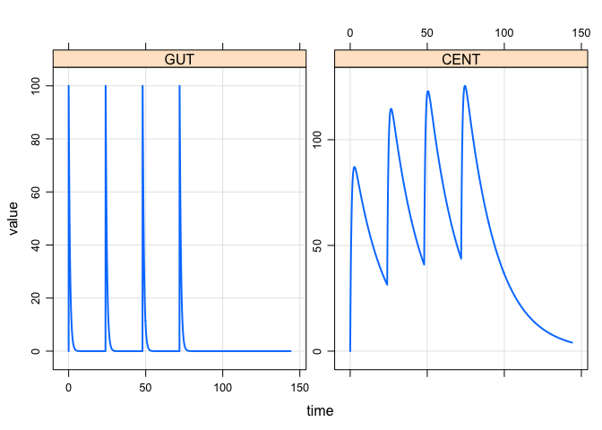

``` r
library(dplyr)
library(mrgsolve)
library(magrittr)
library(ggplot2)
```

`cama` (sah-mah)
================

-   Russian for "herself" (or female "myself")
-   It is what my daughter says when she wants doesn't want any help

``` r
code <- '
$PARAM CL = 1, V = 20, KA = 1.2
$CMT GUT CENT
$PKMODEL ncmt=1, depot=TRUE
$ENV
cama <- function(.mod,...) {
  .mod %>% 
    ev(amt=100, ii=24, addl=3) %>%
    mrgsim(end=144, delta=0.1)
}
'
```

``` r
mod <- mcode("cama", code)
```

    . Compiling cama ...

    . done.

``` r
cama(mod)
```

    . Model:  cama.cpp 
    . Dim:    1442 x 4 
    . Time:   0 to 144 
    . ID:     1 
    .      ID time    GUT  CENT
    . [1,]  1  0.0   0.00  0.00
    . [2,]  1  0.0 100.00  0.00
    . [3,]  1  0.1  88.69 11.28
    . [4,]  1  0.2  78.66 21.23
    . [5,]  1  0.3  69.77 29.99
    . [6,]  1  0.4  61.88 37.71
    . [7,]  1  0.5  54.88 44.50
    . [8,]  1  0.6  48.68 50.47

``` r
cama(mod) %>% plot
```


