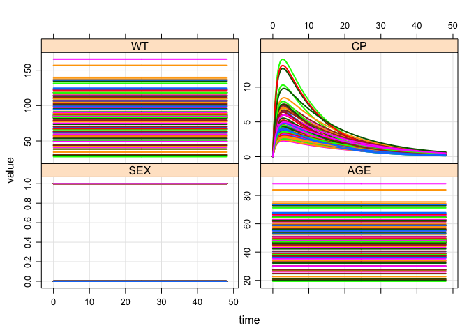

``` r
library(dplyr)
library(mrgsolve)
library(magrittr)
library(ggplot2)
```

See `$ENV` for covariate simulation from bounded parametric distributions
=========================================================================

-   `a`, `b`, `d`, `f` are special formulae that work with `mutate_random` package
-   We create sets of covariates (`covset()`) with these different formulae
-   When we call `idata_set`, we can invoke a `covset` and those covariates get added
-   The `covset` stuff (with formula parsing) is located here:
    -   <https://github.com/kylebmetrum/dmutate>
-   In the `mrgsolve` implementation, we attach parameters to the evaluation environment, so we can use parameter names in the formulae.

``` r
code <- '
$PARAM TVCL = 1, TVV = 20, TVKA = 1
pfe = 0.7, tvwt = 80, tvage = 48
WT = 70, AGE = 50, SEX = 0

$CMT GUT CENT
$PKMODEL ncmt=1, depot=TRUE
$SET req=""

$MAIN
double CL = TVCL*pow(WT/70,0.75);
double V  = TVV*(WT/70);
double KA = TVKA+0.002*(AGE-50);

if(SEX==0) V = V*0.7;
if(AGE > 65) V = V*0.8;

$CAPTURE SEX AGE WT

$ENV
a <- SEX ~ rbinomial(pfe);
b <- WT[50,100] ~ rnorm(tvwt,40)
d <- AGE[18,80] ~ rnorm(tvage,20)
f <- FLAG ~ runif(20,40) | GROUP

cov1 <- covset(a,b)
cov2 <- covset(b,d,a,f)

$TABLE
capture CP = CENT/V;
'
```

``` r
mod <- mcode("foo", code)
```

    . Compiling foo ...

    . done.

``` r
idata <- data_frame(ID=1:100,GROUP=ID%%2)
```

When you call `idata_set`, name the covset you want to invoke

``` r
mod %>% 
  idata_set(idata, covset="cov2") %>% 
  ev(amt=100) %>% mrgsim(end=48) %>% plot
```



Working with `covset`
---------------------

-   All of the code and workflow that happens "inside" mrgsolve `$ENV` can be implemented in plain old `R`

An "environment" where to find symbols on rhs

``` r
e <- as.list(param(mod))
```

Columns to add to the data set

``` r
a <- SEX ~ rbinomial(pfe);
b <- WT[50,100] ~ rnorm(tvwt,40)
d <- AGE[18,80] ~ rnorm(tvage,20)
f <- FLAG ~ runif(20,40) | GROUP
```

Create the set of covariates that you want to add

``` r
cov2 <- covset(d,f,b,a)
```

``` r
cov2
```

    . $d
    . [1] "AGE[18, 80] ~ rnorm(tvage, 20)"
    . 
    . $f
    . [1] "FLAG ~ runif(20, 40) | GROUP"
    . 
    . $b
    . [1] "WT[50, 100] ~ rnorm(tvwt, 40)"
    . 
    . $a
    . [1] "SEX ~ rbinomial(pfe)"

Add covariates to the data

``` r
idata %>% mrgsolve:::mutate_random(cov2,envir=e)
```

    . # A tibble: 100 × 6
    .       ID GROUP      AGE     FLAG       WT   SEX
    .    <int> <dbl>    <dbl>    <dbl>    <dbl> <dbl>
    . 1      1     1 52.00832 33.18963 56.39856     1
    . 2      2     0 61.83073 30.38936 50.83221     1
    . 3      3     1 49.60105 33.18963 86.39854     1
    . 4      4     0 39.07223 30.38936 64.46782     1
    . 5      5     1 54.91050 33.18963 57.56074     1
    . 6      6     0 31.75536 30.38936 69.50669     1
    . 7      7     1 49.07430 33.18963 70.85583     1
    . 8      8     0 64.34133 30.38936 60.43226     1
    . 9      9     1 30.61147 33.18963 50.75021     1
    . 10    10     0 63.36202 30.38936 88.65888     0
    . # ... with 90 more rows

Other ways to use `$ENV`
========================

-   Store `data.frame`
-   Store `event` objects
-   Store (and call) `function`

``` r
code <- '
$PARAM CL = 1, TVV = 20, KA = 1, WT = 70

$CMT GUT CENT
$PKMODEL ncmt=1, depot=TRUE
$SET req=""

$MAIN double V = TVV*(WT/70);

$ENV
d <- expand.ev(ID=1:10, amt=c(100,300))

e <- ev(amt=100, ii=24, addl=3)

sk <- function(n,...) data_frame(ID=1:n)

wt <- covset(list(WT ~ runif(40,140)))

$TABLE
capture CP = CENT/V;
'
```

``` r
mod <- mcode("env", code)
```

    . Compiling env ...

    . done.

Invoke an event stored in `$ENV`

``` r
mod %>% ev(object="e") %>% mrgsim(end=120) %>% plot
```


Build idata set with covariates from a function in `$ENV`

``` r
mod %>% 
  ev(amt=100) %>% 
  idata_set(object="sk", covset="wt", n=100) %>% 
  mrgsim(end=48,delta=0.1) %>% plot
```


