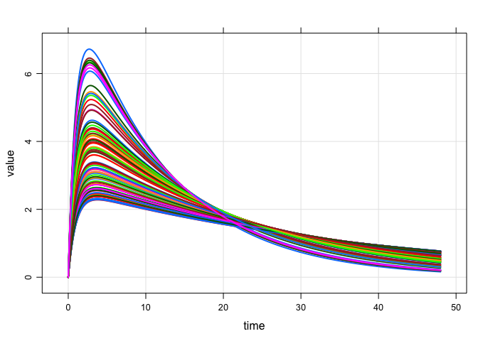

``` r
library(dplyr)
library(mrgsolve)
library(magrittr)
library(ggplot2)
```

See `$COVSET` for covariate simulation from bounded parametric distributions
============================================================================

-   We specify covariates as random variables, potentially with lower and upper bounds
-   We can evaluate an expression in the data with a formula using `expr` function
-   All of these covariates get added to your `data_set` or `idata_set`
-   We create sets of covariates (`covset()`) with these different formulae
-   When we call `idata_set`, we can invoke a `covset` and those covariates get added
-   The `covset` stuff (with formula parsing) is located here:
    -   <https://github.com/kylebmetrum/dmutate>
-   In the `mrgsolve` implementation, we attach parameters to the evaluation environment, so we can use parameter names in the formulae.

``` r
code <- '
$PARAM TVCL = 1, TVV = 20, TVKA = 1
pfe = 0.7, tvwt = 80, tvage = 48
WT = 70, AGE = 50, SEX = 0, theta3 = 11

$PKMODEL cmt="GUT,CENT" , depot=TRUE
$SET req="", delta=0.25

$MAIN
double CL = TVCL*pow(WT/70,0.75);
double V  = TVV*(WT/70);
double KA = TVKA+0.002*(AGE-50);

if(SEX==0) V = V*0.7;
if(AGE > 65) V = V*0.8;

$CAPTURE SEX AGE WT

$COVSET @name cov1
STUDY ~ expr(sample(ID)%%2)
b ~ expr(11)
SEX ~ rbinomial(pfe)
AGE[18,90] ~ rnorm(tvage,20)
WT ~ expr(AGE*2-b)
FLAG ~ runif(20,40) | STUDY

$TABLE capture CP = CENT/V;
'
```

``` r
mod <- mcode("foo", code)
```

``` r
idata <- data_frame(ID=1:100)
```

When you call `idata_set`, name the covset you want to invoke

``` r
mod %>% 
  idata_set(idata, covset="cov1") %>% 
  ev(amt=100) %>% mrgsim(end=48) %>% plot
```


Here's what is happening:

``` r
mod %>% idata_set(idata, covset="cov1") %>% simargs %>% lapply(head)
```

    . $idata
    .   ID STUDY  b SEX      AGE        WT     FLAG
    . 1  1     0 11   0 35.04489  59.08979 22.65316
    . 2  2     0 11   0 32.02988  53.05976 22.65316
    . 3  3     1 11   1 31.30732  51.61465 23.96778
    . 4  4     0 11   1 73.40492 135.80983 22.65316
    . 5  5     0 11   1 55.78038 100.56075 22.65316
    . 6  6     1 11   1 51.32341  91.64681 23.96778

Working with `covset`
---------------------

-   All of the code and workflow that happens "inside" mrgsolve `$ENV` can be implemented in plain old `R`

An "environment" where to find symbols on rhs

``` r
e <- as.list(param(mod))
```

Columns to add to the data set

``` r
a <- SEX ~ rbinomial(pfe);
b <- WT[50,100] ~ rnorm(tvwt,40)
d <- AGE[18,80] ~ rnorm(tvage,20)
s <- STUDY ~ expr(sample(ID)%%2)
f <- FLAG ~ runif(20,40) | STUDY
```

Create the set of covariates that you want to add

``` r
cov2 <- covset(d,s,f,b,a)
```

``` r
cov2
```

    . $d
    . [1] "AGE[18, 80] ~ rnorm(tvage, 20)"
    . 
    . $s
    . [1] "STUDY ~ expr(sample(ID)%%2)"
    . 
    . $f
    . [1] "FLAG ~ runif(20, 40) | STUDY"
    . 
    . $b
    . [1] "WT[50, 100] ~ rnorm(tvwt, 40)"
    . 
    . $a
    . [1] "SEX ~ rbinomial(pfe)"
    . 
    . attr(,"class")
    . [1] "covset"

Add covariates to the data

``` r
idata %>% mrgsolve:::mutate_random(cov2,envir=e)
```

    . # A tibble: 100 × 6
    .       ID      AGE STUDY     FLAG       WT   SEX
    .    <int>    <dbl> <dbl>    <dbl>    <dbl> <dbl>
    . 1      1 38.83624     1 38.98358 71.18658     1
    . 2      2 38.55740     0 27.57983 86.84400     1
    . 3      3 55.65744     1 38.98358 69.13599     1
    . 4      4 47.50965     0 27.57983 79.28044     0
    . 5      5 56.29386     1 38.98358 64.85414     1
    . 6      6 79.26381     0 27.57983 73.57297     1
    . 7      7 60.91842     1 38.98358 90.66608     1
    . 8      8 72.80971     0 27.57983 86.09766     1
    . 9      9 74.62937     0 27.57983 81.74370     1
    . 10    10 55.19484     0 27.57983 87.28695     1
    . # ... with 90 more rows

Other ways to use `$ENV`
========================

-   Store `data.frame`
-   Store `event` objects
-   Store (and call) `function`

``` r
code <- '
$PARAM CL = 1, TVV = 20, KA = 1, WT = 70

$PKMODEL cmt="GUT,CENT", depot=TRUE
$SET req=""

$MAIN double V = TVV*(WT/70);

$COVSET @name wt
WT ~ runif(40,140)

$ENV
d <- expand.ev(ID=1:10, amt=c(100,300))

e <- ev(amt=100, ii=24, addl=3)

skele <- function(n,...) data_frame(ID=1:n)


$TABLE
capture CP = CENT/V;
'
```

``` r
mod <- mcode("env", code)
```

Invoke an event stored in `$ENV`

``` r
mod %>% ev(object="e") %>% mrgsim(end=120) %>% plot
```


Build `idata_set` with covariates from a function in `$ENV`

``` r
mod %>% 
  ev(amt=100) %>% 
  idata_set(object="skele", covset="wt", n=100) %>% 
  mrgsim(end=48,delta=0.1) %>% plot
```


