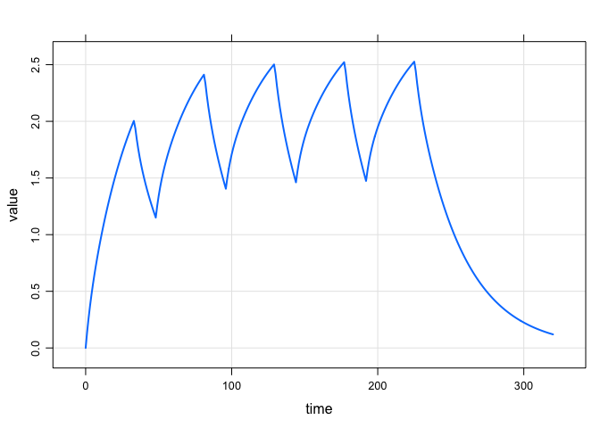
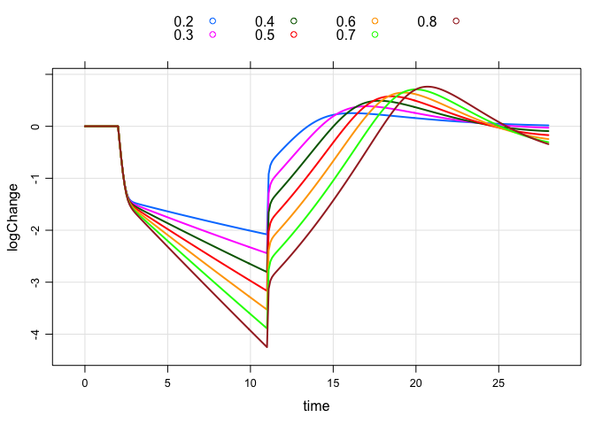

Access models formerly in `modmrg`
==================================

``` r
library(mrgsolve)
```

    . mrgsolve: Community Edition

    . www.github.com/metrumresearchgroup/mrgsolve

### PK model

``` r
mod <- mread("pk2cmt", modlib())
```

    . Compiling pk2cmt ...

    . done.

``` r
mod %>%
  ev(amt=100,rate=3,addl=4,ii=48,cmt=2) %>%
  mrgsim(end=320) %>% 
  plot(CP~.)
```



### Viral model

``` r
mod <- mread("viral1",modlib())
```

    . Compiling viral1 ...

    . done.

``` r
e <- 
  ev(amt=50, cmt="expos",time=2) + 
  ev(amt=0, cmt="expos", evid=8,time=11)

out <- 
  mod %>%
  ev(e) %>%
  update(end=28,delta=0.1) %>%
  knobs(delta=seq(0.2,0.8,0.1))


plot(out,logChange~time,groups=delta,auto.key=list(columns=4))
```



### Ooops

``` r
mod <- mread("kylebaron", modlib())
```

    . mrgsolve internal library:

    .   pk1cmt
    .   pk2cmt
    .   pk3cmt
    .   irm1
    .   irm2
    .   irm3
    .   emax
    .   tmdd
    .   viral1
    .   viral2
    .   effect
