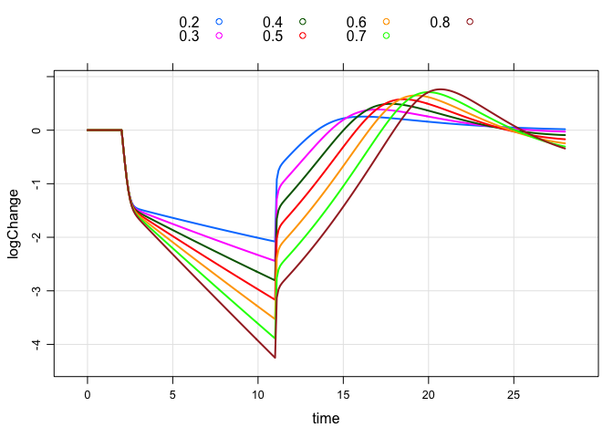
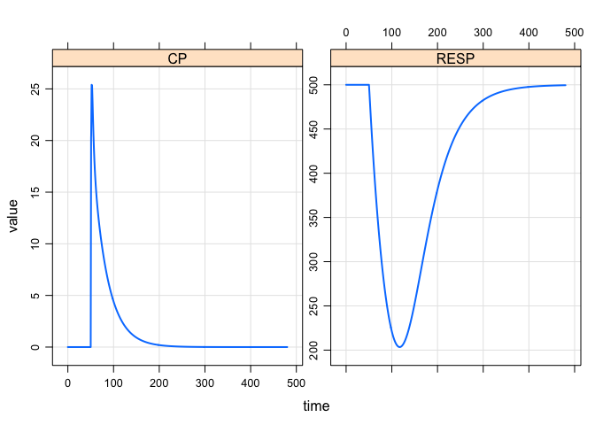

Access models formerly in `modmrg`
==================================

``` r
library(mrgsolve)
```

    . mrgsolve: Community Edition

    . www.github.com/metrumresearchgroup/mrgsolve

### PK model

``` r
mod <- mread("pk2cmt", modlib())
```

    . Compiling pk2cmt ...

    . done.

``` r
mod %>%
  ev(amt=100,rate=3,addl=4,ii=48,cmt=2) %>%
  mrgsim(end=320) %>% 
  plot(CP~.)
```


``` r
see(mod)
```

    . 
    . Model file:  pk2cmt.cpp 
    .  $PROB
    .  # Model: `pk2cmt`
    .    - Two-compartment PK model
    .        - Dual first-order absorption
    .        - Optional nonlinear clearance from `CENT`
    .    - Source: `mrgsolve` internal library
    .    - Date: `r Sys.Date()`
    .    - Version: `r packageVersion("mrgsolve")`
    .    
    .  $PARAM @annotated
    .  CL   :  1  : Clearance (volume/time)
    .  VC   : 20  : Central volume (volume)
    .  Q    :  2  : Inter-compartmental clearance (volume/time)
    .  VP   : 10  : Peripheral volume of distribution (volume)
    .  KA1  :  1  : Absorption rate constant 1 (1/time)
    .  KA2  :  1  : Absorption rate constant 2 (1/time)
    .  VMAX :  0  : Maximum velocity (mass/time)
    .  KM   :  2  : Michaelis Constant (mass/volume)
    .  
    .  $CMT  @annotated
    .  EV1    : First extravascular compartment (mass)
    .  CENT   : Central compartment (mass)
    .  PERIPH : Peripheral compartment (mass) 
    .  EV2    : Second extravascular compartment (mass)
    .    
    .  $GLOBAL 
    .  #define CP (CENT/VC)
    .  #define CT (PERIPH/VP)
    .  #define CLNL (VMAX/(KM+CP))
    .  
    .  $ODE
    .  dxdt_EV1 = -KA1*EV1;
    .  dxdt_EV2 = -KA2*EV2;
    .  dxdt_CENT = KA1*EV1 + KA2*EV2 - (CL+CLNL+Q)*CP  + Q*CT;
    .  dxdt_PERIPH = Q*CP - Q*CT;
    .  
    .  $CAPTURE  @annotated
    .  CP : Plasma concentration (mass/time)
    . 

### Viral model

``` r
mod <- mread("viral1",modlib())
```

    . Compiling viral1 ...

    . done.

``` r
e <- 
  ev(amt=50, cmt="expos",time=2) + 
  ev(amt=0, cmt="expos", evid=8,time=11)

out <- 
  mod %>%
  ev(e) %>%
  update(end=28,delta=0.1) %>%
  knobs(delta=seq(0.2,0.8,0.1))


plot(out,logChange~time,groups=delta,auto.key=list(columns=4))
```



### PK/PD model

``` r
mod <- mread("irm1", modlib())
```

    . Compiling irm1 ...

    . done.

``` r
see(mod)
```

    . 
    . Model file:  irm1.cpp 
    .  $PROB
    .  # Model: `irm1`
    .    - Indirect response model, type 1
    .        - Inhibition of response input
    .        - Two-compartment PK model
    .        - Optional nonlinear clearance
    .    - Source: `mrgsolve` internal library
    .    - Date: `r Sys.Date()`
    .    - Version: `r packageVersion("mrgsolve")`
    .  
    .  $PARAM @annotated
    .  CL   :  1  : Clearance (volume/time)
    .  VC   : 20  : Central volume (volume)
    .  Q    :  2  : Inter-compartmental clearance (volume/time)
    .  VP   : 10  : Peripheral volume of distribution (volume)
    .  KA1  :  1  : Absorption rate constant 1 (1/time)
    .  KA2  :  1  : Absorption rate constant 2 (1/time)
    .  KIN  : 10  : Response in rate constant (1/time)
    .  KOUT :  2  : Response out rate constant (1/time)
    .  IC50 :  2  : Concentration for 50% of max inhibition (mass/volume)
    .  IMAX :  1  : Maximum inhibition 
    .  n    :  1  : Emax model sigmoidicity
    .  VMAX :  0  : Maximum reaction velocity (mass/time)
    .  KM   :  2  : Michaelis constant (mass/volume)
    .  
    .  $CMT  @annotated
    .  EV1    : First extravascular compartment (mass)
    .  CENT   : Central compartment (mass)
    .  PERIPH : Peripheral compartment (mass) 
    .  RESP   : Response compartment
    .  EV2    : Second extravascular compartment (mass)
    .  
    .  $GLOBAL
    .  #define CP (CENT/VC)
    .  #define CT (PERIPH/VP)
    .  #define CLNL (VMAX/(KM+CP))
    .  #define INH (IMAX*pow(CP,n)/(pow(IC50,n)+pow(CP,n)))
    .  
    .  $MAIN
    .  RESP_0 = KIN/KOUT;
    .  
    .  $ODE
    .  dxdt_EV1    = -KA1*EV1;
    .  dxdt_EV2    = -KA2*EV2;
    .  dxdt_CENT   =  KA1*EV1 + KA2*EV2 - (CL+CLNL+Q)*CP  + Q*CT;
    .  dxdt_PERIPH =  Q*CP - Q*CT;
    .  dxdt_RESP   =  KIN*(1-INH) - KOUT*RESP;
    .  
    .  $CAPTURE @annotated
    .  CP : Plasma concentration (mass/volume)

``` r
mod %>% ev(amt=700,time=50) %>% param(n=1.5,KOUT=0.02) %>%
  mrgsim(end=480) %>% plot(CP+RESP~.)
```


